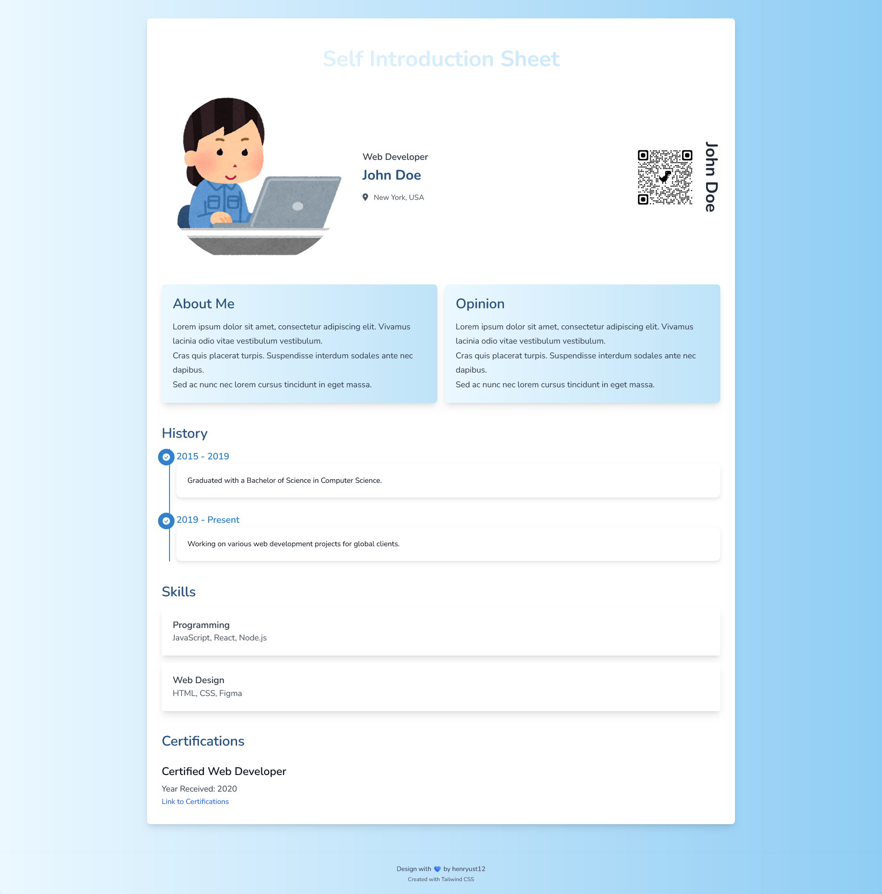

# Jiko-shoukai Sheet

---

[日本語](./README-ja.md)　ー　[ENGLISH](./README-en.md)　ー　[Bahasa Indonesia](./README.md)

---

This is a simple web project designed to display a responsive self-introduction sheet using HTML, CSS (Tailwind), and JavaScript. The application allows you to introduce personal information, career history, skills, and certifications in a structured and easily updatable format.

## How to Obtain the Sources

To get the source code for this project, you can choose one of the following two methods:

1. **Download ZIP:**
   - Click the "Code" button at the top of the repository page, then select "Download ZIP."
   - Extract the ZIP file on your computer.

2. **Clone Repository:**
   - Open your terminal or command prompt.
   - Run the following command to clone this repository to your computer:

   ```bash
     git clone https://github.com/henryust12/jikou-shoukai.git
    ```

## Struktur Folder

- **assets/**
  - `style.css`: CSS style using Tailwind CSS
  - `my-pic.png`: Profile image displayed on the page
  - `qr-code.png`: QR code image for copying the URL
  - `jquery-3.7.1.min.js`: jQuery library for DOM manipulation
  - `js-yaml.min.js`: Library for parsing YAML
- **info.yml**: YAML file containing personal information, history, skills, and certifications
- **i18n.yml**: YAML file containing locale strings for i18n
- **index.html**: Main HTML page

> You can create a URL QR code for free. Some websites you can use include qr.quel.jp/url.php, qrcode-monkey.com, and adobe.com/express/feature/image/qr-code-generator.
>
> You can also use Chrome and its derivatives by right-clicking on a page and selecting the option "Create QR Code for this page." More details can be found at yrl.com/column/wazaari_pc/url_qr_code_web_browser.html.
>
> Additionally, there are many other methods you can find on the internet by searching for the keyword `URL to QR code`.

## Technologies Used

This project uses the following technologies:

- **HTML5:** For web page structure.
- **Tailwind CSS v3.4.7:** For styling and ensuring responsive design.
- **JavaScript (jQuery v3.7.1):** For interactivity and fetching data from YAML files.
- **YAML:** For storing dynamic data and locale strings (i18n).

## Fully Responsive Design

The self-introduction sheet design is fully responsive, so the layout adjusts to various screen sizes, from mobile devices to desktops.

## Information about `i18n.yml`

The `i18n.yml` file is used to store locale strings that can be translated into different languages. These strings include titles, labels, and text used on the self-introduction page.

- **Usage**: You can modify the text in this file to accommodate different languages or terminology. However, the structure of this file cannot be changed, and you cannot add new fields.

## Information about `info.yml`

The `info.yml` file contains personal information, career history, skills, and certifications displayed on the page. The content in this file can be easily updated without needing to edit the HTML.

- **Usage**: You can change the values in info.yml to adjust the information displayed. However, ensure that you do not add new fields to this file, as the file structure is fixed and cannot be altered.


## License

This project is licensed under the [MIT License](LICENSE). You are free to use, modify, and distribute this project, provided you include this license in the project copies.

## Contributions and Issues

If you encounter any bugs, have ideas for new features, or need help or have questions, please open an [issue](https://github.com/henryust12/jikou-shoukai/issues) in this repository. We highly value feedback and contributions from the community.

- **How to Contribute**: To contribute to this project, fork the repository, make changes in your branch, and then create a pull request. We will be happy to review and merge your contributions!

## Support

If you like this project, please give it a star (⭐) on the repository. Your support is greatly appreciated and helps in developing and improving the project.

---

Thank you for using this project!

---

### Screenshot

