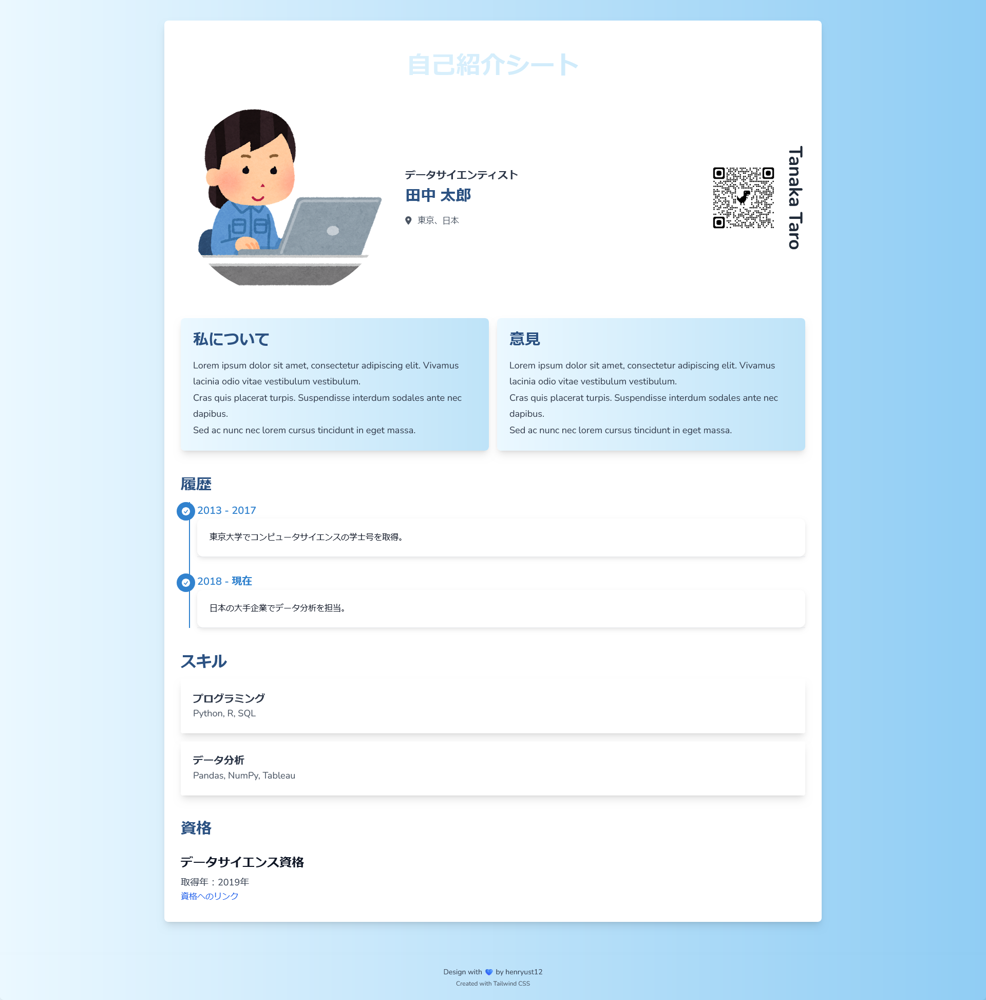

# 自己紹介シート

---

[日本語](./README-ja.md)　ー　[ENGLISH](./README-en.md)　ー　[Bahasa Indonesia](./README.md)

---

これは、HTML、CSS（Tailwind）、JavaScriptを使用して、自己紹介シートをレスポンシブに表示するために作成されたシンプルなウェブプロジェクトです。このアプリケーションでは、個人情報、キャリアの履歴、スキル、および認証を構造化された形式で紹介し、簡単に更新できるようにします。

## ソースコードの取得方法

このプロジェクトのソースコードを取得するには、次のいずれかの方法を選択してください:

1. **ZIPファイルをダウンロード:**
   - リポジトリのページ上部にある「Code」ボタンをクリックし、「Download ZIP」を選択します。
   - ZIPファイルをコンピュータに解凍します。

2. **リポジトリをクローンする:**
   - ターミナルまたはコマンドプロンプトを開きます。
   - 次のコマンドを実行して、このリポジトリをコンピュータにクローンします:

     ```bash
     git clone https://github.com/henryust12/jikou-shoukai.git
     ```

## フォルダー構造

- **assets/**
  - `style.css`: Tailwind CSSでスタイルを設定したCSS
  - `my-pic.png`: ページに表示されるプロフィール画像
  - `qr-code.png`: URLをコピーするためのQRコード画像
  - `jquery-3.7.1.min.js`: DOM操作のためのjQueryライブラリ
  - `js-yaml.min.js`: YAMLパースのためのライブラリ
- **info.yml**: 個人情報、キャリア、スキル、資格を含むYAMLファイル
- **i18n.yml**: i18n用のローカライズ文字列を含むYAMLファイル
- **index.html**: メインのHTMLページ

> 無料でURLのQRコードを作成できます。利用できるウェブサイトには、qr.quel.jp/url.php、qrcode-monkey.com、adobe.com/express/feature/image/qr-code-generator があります。
>
> また、Chromeなどのブラウザを使用して、ページ上で右クリックし、「このページのQRコードを作成」を選択することもできます。詳しくは、yrl.com/column/wazaari_pc/url_qr_code_web_browser.html をご覧ください。
>
> さらに、インターネットで「`URL to QR code`」というキーワードを検索すると、他の方法もたくさん見つかります。

## 使用されている技術

このプロジェクトでは、次の技術が使用されています:

- **HTML5:** ウェブページの構造を作成するため。
- **Tailwind CSS v3.4.7:** スタイリングとレスポンシブデザインを確保するため。
- **JavaScript (jQuery v3.7.1):** インタラクティブ機能とYAMLファイルからのデータ取得のため。
- **YAML:** 動的データとローカライズ文字列（i18n）を保存するため。

## 完全レスポンシブデザイン

この自己紹介シートのデザインは完全にレスポンシブであり、モバイルデバイスからデスクトップまで、さまざまな画面サイズに対応して表示が調整されます。

## `i18n.yml` に関する情報

`i18n.yml` ファイルは、さまざまな言語に翻訳可能なローカライズされた文字列を保存するために使用されます。これらの文字列には、タイトル、ラベル、および自己紹介ページで使用されるテキストが含まれます。

- **使用方法:** このファイル内のテキストを変更して、異なる言語や用語に対応させることができます。ただし、ファイルの構造を変更したり、新しいフィールドを追加したりすることはできません。

## `info.yml` に関する情報

`info.yml` ファイルには、ページに表示される個人情報、キャリア履歴、スキル、および資格が保存されています。このファイル内のコンテンツは、HTMLを編集することなく簡単に更新できます。

- **使用方法:** `info.yml` にある値を変更することで、表示される情報を調整することができます。ただし、新しいフィールドをファイルに追加しないようにしてください。ファイルの構造は固定されており、変更できません。


## ライセンス

このプロジェクトは、[MITライセンス](LICENSE)の下でライセンスされています。このライセンスをプロジェクトのコピーに含める条件で、プロジェクトの使用、変更、配布が自由に行えます。


## 貢献と問題報告

バグを見つけた場合や、新機能のアイデアがある場合、質問や助けが必要な場合は、[issue](https://github.com/henryust12/jikou-shoukai/issues)をリポジトリで開いてください。コミュニティからのフィードバックや貢献を大変感謝しています。

- **貢献方法:** このプロジェクトに貢献するには、リポジトリをフォークし、ブランチで変更を行い、プルリクエストを作成してください。喜んであなたの貢献をレビューし、取り入れさせていただきます！

## サポート

このプロジェクトを気に入った場合は、リポジトリに星（⭐）を付けてください。あなたのサポートは、このプロジェクトの開発と改善に非常に役立ちます。

---

このプロジェクトをご利用いただき、ありがとうございます！

---

### Screenshot


