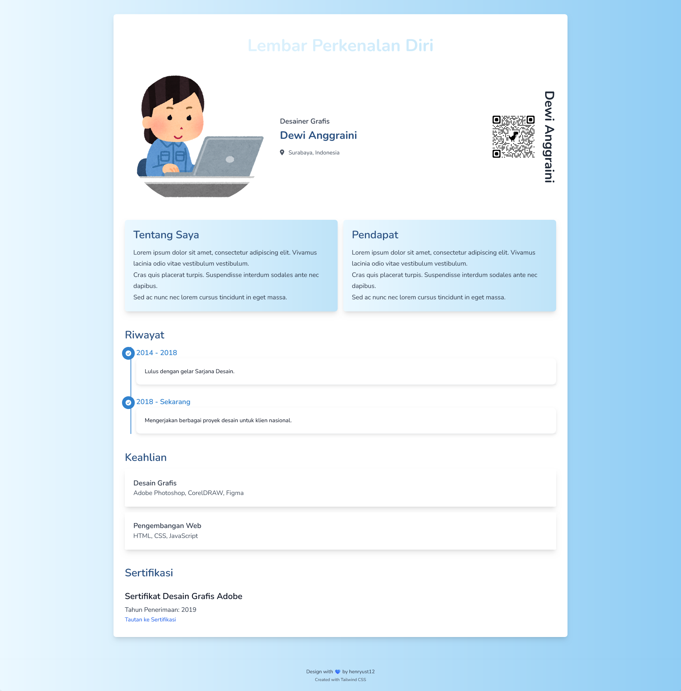

# Lembar Jiko-shoukai

---

[日本語](./README-ja.md)　ー　[ENGLISH](./README-en.md)　ー　[Bahasa Indonesia](./README.md)

---

Ini adalah proyek web sederhana yang dibuat untuk menampilkan lembar pengenalan diri secara responsif menggunakan HTML, CSS (Tailwind), dan JavaScript. Aplikasi ini memungkinkan kamu untuk memperkenalkan informasi pribadi, riwayat karir, keterampilan, dan sertifikasi dalam format yang terstruktur dan mudah di-update.

## Cara Mendapatkan Sources

Untuk mendapatkan source code dari proyek ini, kamu bisa memilih salah satu dari dua cara berikut:

1. **Download ZIP:**
   - Klik tombol "Code" di bagian atas halaman repository, lalu pilih "Download ZIP".
   - Ekstrak file ZIP tersebut di komputer kamu.

2. **Clone Repository:**
   - Buka terminal atau command prompt.
   - Jalankan perintah berikut untuk meng-clone repository ini ke komputer kamu:

    ```bash
     git clone https://github.com/henryust12/jikou-shoukai.git
     ```

## Struktur Folder

- **assets/**
  - `style.css`: Style CSS menggunakan Tailwind CSS
  - `my-pic.png`: Gambar profil yang ditampilkan di halaman
  - `qr-code.png`: Gambar kode QR untuk menyalin URL
  - `jquery-3.7.1.min.js`: Library jQuery untuk manipulasi DOM
  - `js-yaml.min.js`: Library untuk parsing YAML
- **info.yml**: File YAML yang berisi informasi pribadi, riwayat, keterampilan, dan sertifikasi
- **i18n.yml**: File YAML yang berisi string lokal untuk i18n
- **index.html**: Halaman utama HTML

> Kamu bisa membuat QR code URL secara gratis. Beberapa situs yang bisa kamu gunakan adalah qr.quel.jp/url.php, qrcode-monkey.com, dan adobe.com/express/feature/image/qr-code-generator.
>
> Kamu juga bisa menggunakan browser Chrome dan turunannya dengan cara klik kanan di halaman, lalu pilih opsi "Create QR Code for this page." Detailnya bisa dilihat di yrl.com/column/wazaari_pc/url_qr_code_web_browser.html.
>
> Selain itu, masih banyak cara lainnya yang bisa kamu temukan di internet dengan mencari kata kunci `URL to QR code`.

## Teknologi yang Digunakan

Proyek ini menggunakan beberapa teknologi berikut:

- **HTML5:** Untuk struktur halaman web.
- **Tailwind CSS v3.4.7:** Untuk styling dan memastikan desain responsif.
- **JavaScript (jQuery v3.7.1):** Untuk interaktivitas dan pengambilan data dari file YAML.
- **YAML:** Untuk menyimpan data dinamis dan string lokal (i18n).

## Desain Full Responsif

Desain lembar pengenalan diri ini sepenuhnya responsif, sehingga tampilan akan menyesuaikan dengan berbagai ukuran layar, mulai dari perangkat mobile hingga desktop.

## Informasi tentang `i18n.yml`

File `i18n.yml` digunakan untuk menyimpan string lokal yang dapat diterjemahkan ke dalam berbagai bahasa. String-string ini mencakup judul, label, dan teks yang digunakan di halaman pengenalan diri.

- **Penggunaan:** Kamu dapat mengubah teks yang ada dalam file ini untuk mengakomodasi bahasa atau terminologi yang berbeda. Namun, perlu diingat bahwa struktur file ini tidak dapat diubah, dan kamu tidak dapat menambahkan field baru.

## Informasi tentang `info.yml`

File `info.yml` menyimpan informasi pribadi, riwayat karir, keterampilan, dan sertifikasi yang ditampilkan di halaman. Konten dalam file ini dapat dengan mudah diupdate tanpa perlu mengedit HTML.

- **Penggunaan:** Kamu dapat mengubah nilai-nilai yang ada di `info.yml` untuk menyesuaikan informasi yang ditampilkan. Namun, pastikan untuk tidak menambahkan field baru di file ini karena struktur file sudah tetap dan tidak dapat diubah.


## Lisensi

Proyek ini dilisensikan di bawah [MIT License](LICENSE). Kamu bebas untuk menggunakan, memodifikasi, dan mendistribusikan proyek ini dengan syarat harus menyertakan lisensi ini dalam salinan proyek.

## Kontribusi dan Issue

Jika kamu menemukan bug atau memiliki ide untuk fitur baru atau kamu memiliki pertanyaan atau butuh bantuan, silakan buka [issue](https://github.com/henryust12/jikou-shoukai/issues) di repository ini. Kami sangat menghargai masukan dan kontribusi dari komunitas.

- **Cara Berkontribusi:** Untuk berkontribusi pada proyek ini, fork repository ini, buat perubahan di branch kamu, lalu buat pull request. Kami akan dengan senang hati meninjau dan memasukkan kontribusi kamu!

## Dukungan

Jika kamu menyukai proyek ini, silakan berikan bintang (⭐) pada repository ini. Dukungan dari kamu sangat membantu dalam mengembangkan dan memperbaiki proyek ini.

---

Terima kasih telah menggunakan proyek ini!

---

### Screenshot

